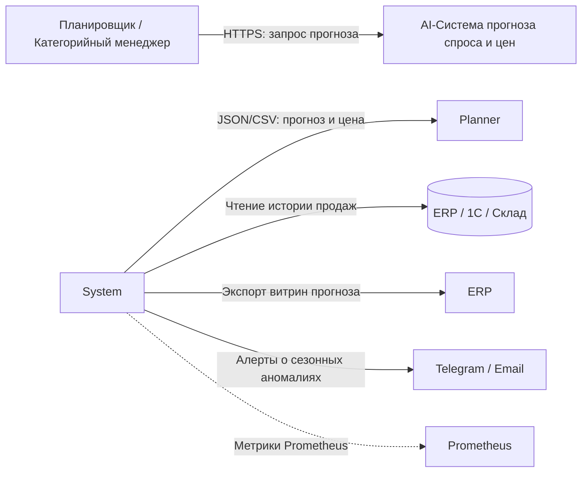
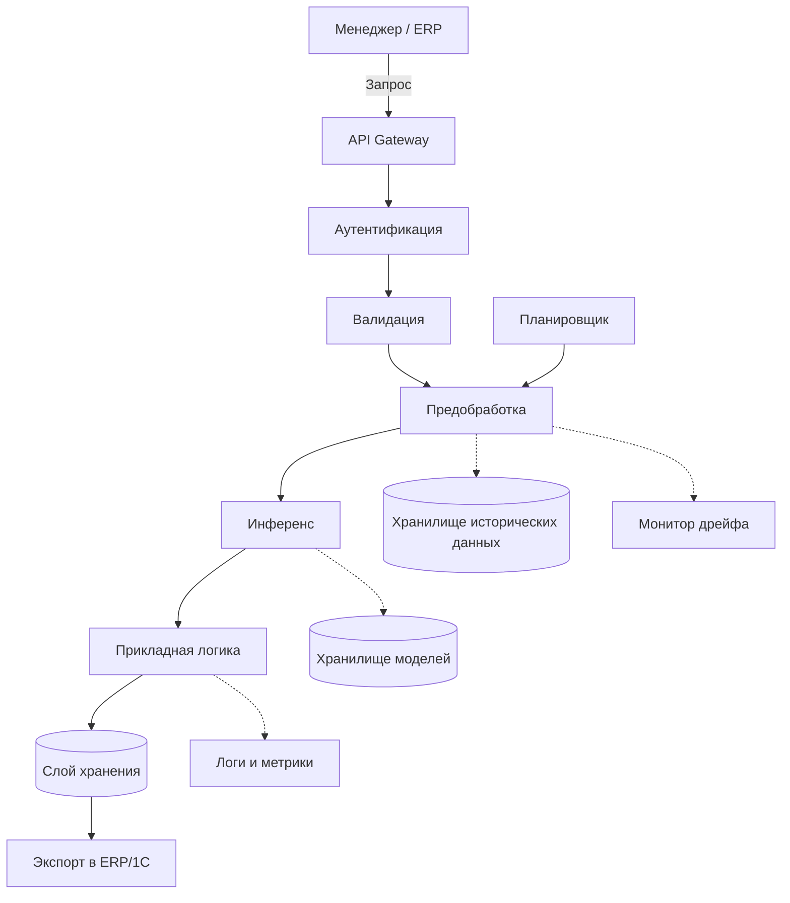

# ai-system-demand-price-forecasting

## AI-система прогнозирования спроса и цен (Demand \& Price Forecasting)


## 1. Бизнес-цель

Сервис прогнозирует спрос на горизонт 7–30 дней для товарных позиций (SKU) и рекомендует цену с учётом сезонности и промоакций.

**Потребители результата:**

- отдел закупок (планирование поставок);

- коммерческий отдел (ценообразование);

- ERP/1С (получает готовую витрину прогноза).


## 2. Метрики эффективности

**Бизнес-метрики:**

- снижение излишков на складе на 15%;

- рост маржинальности на 5%.

**Технические метрики (SLA):**

- пакетный расчёт 10 000 SKU ≤ 30 мин;

- доступность сервиса 99.5%.

**Метрики качества модели:**

- MAPE ≤ 10%;

- WAPE ≤ 12%;

- RMSE — фиксируется как baseline.


## 3. Границы системы (Scope)

**Входит в систему:**

- загрузка исторических данных о продажах и остатках;

- предобработка, извлечение признаков, обучение и инференс;

- расчёт рекомендованной цены;

- экспорт витрины прогноза в ERP/1С;

- логирование и мониторинг качества.

**Не входит в систему:**

- физическая отгрузка товаров;

- бухгалтерские проводки;

- юридическое утверждение цен;

- управление складским оборудованием.


## 4. Таблица требований

| Тип | ID | Формулировка | Критерий приёмки |
|-----|-----|--------------|------------------|
| Функциональное | FR-01 | Приём исторических данных | CSV/Parquet загружается, схема валидируется |
| Функциональное | FR-02 | Пакетный прогноз по расписанию | Airflow/Cron запускает расчёт раз в сутки |
| Функциональное | FR-03 | Экспорт прогноза в ERP/1С | Формируется файл согласованного формата |
| Нефункциональное | NFR-01 | Производительность | 10 000 SKU  ≤ 30 минут |
| Нефункциональное | NFR-02 | Воспроизводимость | Каждый прогноз содержит model_version и run_id |
| Нефункциональное | NFR-03 | Безопасность | Доступ к REST API — только по X-API-Key |


## 5. Контекстная диаграмма (C4 Level 1: System Context)




## 6. Компонентная декомпозиция (C4 Model — Level 2: Container / Component)

*Обязательные программные модули:*

1. API Gateway / Presentation - «входная дверь» сервиса, принимает запросы (FastAPI) и формирует HTTP-ответы;

2. Модуль аутентификации — проверяет X-API-Key в заголовке запроса;

3. Модуль валидации - проверяет, что данные корректны;

4. Модуль предобработки - превращает сырые данные (продажи, календарь) в удобные для модели цифры;

5. Модуль инференса - загружает веса модели из хранилища и выполняет расчёт прогноза;

6. Прикладная логика - рассчитывает спрос за горизонт 7–30 дней, оценивает интервал прогноза, вычисляет рекомендуемую цену;

7. Слой хранения - хранит готовые прогнозы товаров;

8. Хранилище артефактов - хранит обученные модели с версиями;

9. Монитор дрейфа - сравнивает распределение признаков с прогнозом и выявляет аномалии;

10. Модуль наблюдаемости - сбор логов и метрик для мониторинга;

11. Планировщик задач — запускает ночной расчёт по расписанию;

12. Хранилище исторических данных — источник истории продаж, остатков для модуля предобработки.




## 7. Таблица компонентов

| Компонент | Назначение | Вход | Выход | Библиотеки |
|-----------|-----------|------|-------|------------|
| app.api.routes | HTTP-запросы | HTTP Request | HTTP Response | fastapi |
| app.api.schemas | Валидация данных | JSON | Типизированный объект | pydantic |
| app.core.auth| Проверка X-API-Key | Заголовок | 200 / 401 | fastapi |
| app.ml.preprocessing | Подготовка признаков | Сырые данные | NumPy array | numpy, pandas |
| app.ml.inference | Инференс модели | Признаки | Прогноз спроса и цены | joblib |
| app.services.forecast| Бизнес-логика и fallback | Запрос, прогноз | Готовый результат | Python |
| app.repositories | Сохранение прогнозов | Прогноз | Запись в БД | sqlalchemy |
| app.ml.drift | Контроль дрейфа | Признаки | PSI, алерт | evidently |
| app.core.observability | Логи и метрики | События | JSON-логи, /metrics | prometheus-client |
| airflow.dags| Ночной расчёт | Расписание | Запуск задачи | airflow |
| app.storage.dwh | История продаж | SQL-запрос | Данные для модели | sqlalchemy |


## 8. Спецификация контрактов REST API

*Заголовки запроса:*

    Content-Type: application/json
    X-API-Key: <secret_token>

*Схема входных данных (Pydantic):*

```python
from pydantic import BaseModel, Field

class PredictionRequest(BaseModel):
    sku_id: str = Field(description="Уникальный идентификатор товара")
    horizon_days: int = Field(ge=7, le=30, description="Горизонт прогноза в днях")
    base_price: float = Field(ge=0.0, description="Текущая цена товара, руб.")
    promo_flag: bool = Field(default=False, description="Участвует ли товар в промо")
    stock_qty: int = Field(ge=0, description="Текущий остаток на складе")

    class Config:
        json_schema_extra = {
            "example": {
                "sku_id": "SKU_00981",
                "horizon_days": 14,
                "base_price": 799.0,
                "promo_flag": True,
                "stock_qty": 320
            }
        }
```

*Схема успешного ответа (200 OK):*

```python
class PredictionResponse(BaseModel):
    request_id: str = Field(description="UUID запроса для аудита")
    sku_id: str = Field(description="Идентификатор товара")
    forecast_demand: int = Field(description="Прогноз спроса, шт.")
    recommended_price: float = Field(description="Рекомендуемая цена, руб.")
    model_version: str = Field(description="Версия модели")
    stale: bool = Field(description="True, если прогноз устаревший (fallback)")
```

*Пример успешного ответа:*

```json
{
  "request_id": "9b1deb4d-3b7d-4bad-9bdd-2b0d7b3dcb6d",
  "sku_id": "SKU_00981",
  "forecast_demand": 145,
  "recommended_price": 849.0,
  "model_version": "1.3.0",
  "stale": false
}
```

*Ошибки валидации:*

```json
{
  "error": "VALIDATION_FAILED",
  "detail": [
    {
      "field": "horizon_days",
      "message": "Value must be less than or equal to 30"
    }
  ]
}
```

*GET /health — проверка состояния сервиса:*

```json
{
  "status": "healthy",
  "model_loaded": true,
  "model_version": "1.3.0",
  "uptime_seconds": 3600
}
```
GET /metrics — метрики для Prometheus в формате OpenMetrics.


## 9. Информационная безопасность и защита данных

- доступ к сервису — только по ключу X-API-Key;

- ограничение размера запроса и количества запросов в минуту;

- персональные данные людей не обрабатываются (только данные о товарах, остатках и ценах).


## 10. Наблюдаемость (Observability) и аудит

*Пример строки лога:*

{"timestamp": "2026-09-28T02:00:00Z", "level": "INFO", "request_id": "...", "item_id": "...", "latency_ms": 84.2, "status": 200, "forecast_horizon_days": 14, "model_version": "1.0.0"}

**Метрики:**

1. http_requests_total — сколько всего запросов и с каким статусом;

2. forecast_batch_duration_seconds — сколько времени идёт ночной расчёт;

3. forecast_mape_gauge — насколько точный сейчас прогноз.

Для контроля дрейфа данных раз в неделю сравниваем текущее распределение продаж с обучающим, чтобы отследить сдвиги в данных (метод PSI через библиотеку Evidently). Если модель стала хуже предсказывать при стабильном распределении данных, запускаем переобучение на новых данных. Также если фактический результат сильно отличается от прогноза несколько дней подряд — система шлёт уведомление.

