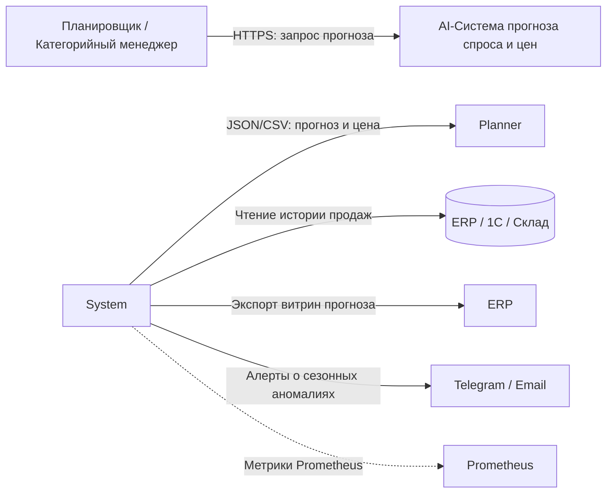

# ai-system-demand-price-forecasting

# AI-система прогнозирования спроса и цен (Demand \& Price Forecasting)

## 1. Бизнес-цель

Сервис прогнозирует спрос на горизонт 7–30 дней для товарных позиций (SKU) и рекомендует цену с учётом сезонности и промоакций.

**Потребители результата:**

- отдел закупок (планирование поставок);

- коммерческий отдел (ценообразование);

- ERP/1С (получает готовую витрину прогноза).

## 2. Метрики эффективности

**Бизнес-метрики:**

- снижение излишков на складе на 15%;

- рост маржинальности на 5%.

**Технические метрики (SLA):**

- пакетный расчёт 10 000 SKU ≤ 30 мин;

- доступность сервиса 99.5%.

**Метрики качества модели:**

- MAPE ≤ 10%;

- WAPE ≤ 12%;

- RMSE — фиксируется как baseline.

## 3. Границы системы (Scope)

**Входит в систему:**

- загрузка исторических данных о продажах и остатках;

- предобработка, извлечение признаков, обучение и инференс;

- расчёт рекомендованной цены;

- экспорт витрины прогноза в ERP/1С;

- логирование и мониторинг качества.

**Не входит в систему:**

- физическая отгрузка товаров;

- бухгалтерские проводки;

- юридическое утверждение цен;

- управление складским оборудованием.

## 4. Таблица требований

| Тип              | ID     | Формулировка              | Критерий приёмки                          |

|------------------|--------|---------------------------|-------------------------------------------|

| Функциональное   | FR-01  | Приём исторических данных | CSV/Parquet загружается и валидируется    |

| Функциональное   | FR-02  | Пакетный прогноз          | Cron/Airflow запускает расчёт раз в сутки |

| Функциональное   | FR-03  | Экспорт в ERP/1С          | Формируется файл согласованного формата   |

| Нефункциональное | NFR-01 | Производительность        | 10 000 SKU ≤ 30 мин                       |

| Нефункциональное | NFR-02 | Воспроизводимость         | Каждый прогноз содержит `model\_version` и `run\_id` |

| Нефункциональное | NFR-03 | Безопасность              | Доступ по `X-API-Key`                     |

## 5. Контекстная диаграмма (C4 Level 1: System Context)

## 6. Компонентная декомпозиция (C4 Model — Level 2: Container / Component)

## 7. Таблица компонентов

## 8. Информационная безопасность и защита данных

- доступ к сервису — только по ключу X-API-Key;

- ограничение размера запроса и количества запросов в минуту;

- персональные данные людей не обрабатываются (только данные о товарах, остатках и ценах).

## 9. Наблюдаемость (Observability) и аудит

*Пример строки лога:*

-

**Метрики:**

1. http_requests_total — сколько всего запросов и с каким статусом;

2. forecast_batch_duration_seconds — сколько времени идёт ночной расчёт;

3. forecast_mape_gauge — насколько точный сейчас прогноз.
